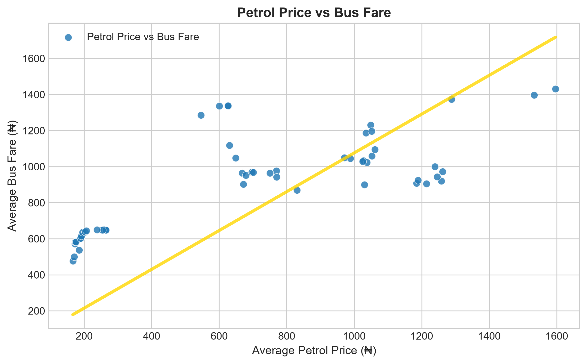

# Can Fuel Price Predict Fares? (Compute Cost)

> An experiment investigating whether changes in petrol prices are associated with changes in intra-city transport fares in Nigeria using linear regression implemented from scratch.

## Project Website

Want to see the results and explore the data interactively?

**[Visit the Compute Cost Project →](https://commute-cost.calebabs207.workers.dev/)**

## Overview

Fuel prices have a noticeable effect on the cost of transportation in Nigeria, but **how strong is the relationship between petrol prices and transport fares?**

This project explores that question using monthly Nigerian data on:

* **Petrol price** - average Premium Motor Spirit (PMS) price per litre
* **Bus fare** - average intra-city bus fare per drop

The main goal was not simply to train a model with a machine-learning library. Instead, this project was built as an exercise in understanding **what happens underneath a linear regression model** and applying that knowledge in a real world project.

The regression algorithm was implemented from scratch using Python and Numpy.

## The Question

**Do increases in petrol prices correspond to increases in intra-city transport fares?**

The project treats:

* **X:** average petrol price (₦/litre)
* **Y:** average intra-city bus fare (₦/drop)

and models their relationship as:

```text
fare = m × fuel_price + b
```

where:

* `m` is the learned slope
* `b` is the learned intercept

## Dataset

The dataset contains **53 monthly observations** combining petrol prices and intra-city bus fares.

The data was obtained from the **National Bureau of Statistics (NBS)**, here are the available links:

* [Premium Motor Spirit (Petrol) Price Watch](https://microdata.nigerianstat.gov.ng/index.php/catalog/157)
* [Transport Fare Watch](https://microdata.nigerianstat.gov.ng/index.php/catalog/161)

The resulting dataset is stored in:

```text
datasets/petrol_transport_data.csv
```

## Project Structure

```text
can-fuel-price-predict-fares/
│
├── datasets/
│   └── petrol_transport_data.csv
│
├── notebooks/
│   └── analysis_from_scratch.ipynb
│
├── src/
│   ├── cost.py
│   ├── data.py
│   ├── gradient_descent.py
│   ├── main.py
│   └── visualise.py
│
└── README.md
```

## What I Implemented

### 1. Data preparation

The raw petrol-price and transport-fare data were combined into a dataset containing the monthly observations used for the analysis.

### 2. Cost function

I implemented the linear regression cost function rather than relying on a machine-learning library to calculate it.

For a linear model:

```text
ŷ = mx + b
```

the mean squared error cost is:

```text
J(m,b) = 1/(2n) Σ(ŷᵢ - yᵢ)²
```

The cost function measures how far the model's predictions are from the observed fares.

### 3. Gradient descent

The model parameters were learned using gradient descent.

The gradients for the slope and intercept are:

```text
∂J/∂m = 1/n Σ(ŷᵢ - yᵢ)xᵢ

∂J/∂b = 1/n Σ(ŷᵢ - yᵢ)
```

The parameters are then updated iteratively:

```text
m := m - α(∂J/∂m)

b := b - α(∂J/∂b)
```

where `α` is the learning rate.

### 4. Visualization

The relationship between petrol prices and transport fares was visualized using the observed data and the learned regression line.

The visualization helps show whether the model is capturing the general direction of the relationship.

<p align="center">
  
</p>

## Results

The model learned the following relationship from the dataset:

```text
fare ≈ 1.0758 × fuel_price + 0.0041
```

The positive slope indicates that, within this dataset, **higher petrol prices are associated with higher intra-city bus fares**.

However, this result should not be interpreted as proof that petrol prices are the sole cause of changes in transport fares.

Transport fares can also be affected by other factors such as:

* Vehicle Maintenance Costs
* Spare-Parts Prices
* Inflation
* Exchange Rates
* Road Conditions
* Demand
* Government Policies
* Operating Costs

This project deliberately uses **One Feature - Petrol Price** so that the mechanics of **univariate linear regression** can be studied clearly.

## Why Build Linear Regression From Scratch?

Using:

```python
from sklearn.linear_model import LinearRegression
```

would make the implementation much shorter, but it would hide most of the mechanics I wanted to understand.

Implementing the model myself provided practice with:

* Mathematical Formulation of a Machine Learning Problem
* Vectorized NumPy Operations
* Cost Functions
* Gradients
* Gradient Descent
* Parameter Updates
* Model Convergence
* Visualizing Model Behavior

The purpose of this project was therefore as much about **understanding the algorithm** as it was about answering the transportation question.

## Running the Project

Clone the repository:

```bash
git clone https://github.com/Calibaba276/can-fuel-price-predict-fares.git
cd can-fuel-price-predict-fares
```

Install the required dependencies:

```bash
pip install -r requirements.txt
```

Then explore the implementation in:

```text
notebooks/analysis_from_scratch.ipynb
```

The main implementation is contained in:

```text
src/
```

## Key Learning

One of the main lessons from this project was that a machine-learning algorithm becomes much easier to reason about when its individual components are understood.

Instead of treating linear regression as a black box, the project breaks it down into:

```text
Data
  ↓
Model
  ↓
Prediction
  ↓
Cost
  ↓
Gradient
  ↓
Parameter Update
  ↓
Repeat
```

That process made the transition from the mathematics of linear regression to an actual implementation much clearer.

## Limitations

This is a **simple univariate regression experiment**, not a complete transportation-fare forecasting system.

The model uses only petrol price as a predictor, meaning it cannot account for the many other variables that influence transport fares.

Additionally, an observed relationship between two variables does not establish causation.

Therefore, the result should be interpreted as:

> **Petrol prices and intra-city transport fares show a positive relationship in the analyzed data.**

rather than:

> **Every increase in petrol price directly causes a corresponding increase in transport fares.**

## Future Improvements

Possible extensions include:

* Adding additional Economic Variables
* Experimenting with Multiple Linear Regression
* Evaluating the model using train/test splits
* Comparing the from-scratch implementation with scikit-learn
* Experimenting with different optimization methods
* Investigating time-series approaches
* Analyzing lagged effects between fuel-price changes and fare changes

Feel free to **Contribute** to bring all these great suggestions to LIFE! 

## Data Source

Data was obtained from the [**National Bureau of Statistics (NBS), Nigeria**](https://microdata.nigerianstat.gov.ng/index.php/home).

The project combines information from the NBS Petrol Price Watch and Transport Fare Watch datasets.

## License

This project is intended primarily as a learning and experimentation project. **Contributions are always Welcome!**
